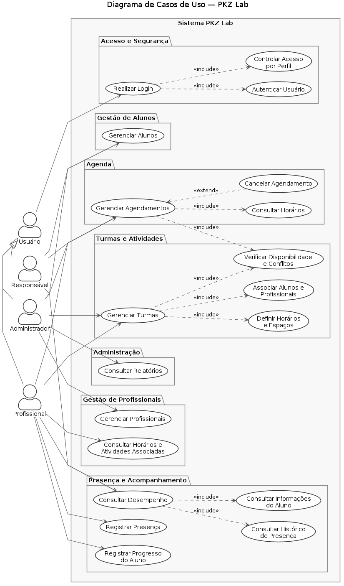

## Casos de Uso

Os casos de uso descrevem as principais interações entre os usuários e o sistema de gestão do PKZ Lab, representando as funcionalidades disponíveis de acordo com os diferentes perfis de acesso. A documentação apresenta os atores envolvidos, as pré-condições, o fluxo básico, os fluxos alternativos e as pós-condições de cada caso de uso.

## Diagrama

> Código-fonte: [diagrama_caso_de_uso.puml](diagrama_caso_de_uso.puml)

### Descrição:

- Acesso e Segurança
    
    - Realizar Login
    - Autenticar Usuário
    - Controle de acesso por perfil
        
- Alunos
    
    - Gerenciar Alunos
    - Consultar informações do aluno
    - Consultar histórico de presença
        
- Profissionais
    
    - Gerenciar Profissionais
    - Consultar horários e atividades associadas
        
- Turmas e Atividades
    
    - Gerenciar Turmas
    - Associar alunos e profissionais
    - Definir horários e espaços
        
- Agenda
    
    - Gerenciar Agendamentos
    - Consultar horários
    - Verificar disponibilidade e conflitos
    - Cancelar agendamentos
        
- Presença e Acompanhamento
    
    - Registrar Presença
    - Registrar Progresso do Aluno
    - Consultar Desempenho
        
- Administração
    
    - Gerenciar Alunos
    - Gerenciar Profissionais
    - Gerenciar Turmas
    - Gerenciar Agendamentos
    - Consultar Relatórios

### Realizar Login

**Atores:** Usuário, Sistema

**Pré-Condições:**

* Usuário deve estar previamente cadastrado no sistema.
* Usuário deve possuir credenciais de acesso válidas.

**Fluxo Básico:**

1. Usuário informa e-mail e senha.
2. Sistema autentica o usuário.
3. Sistema identifica o perfil de acesso.
4. Sistema disponibiliza as funcionalidades permitidas para o perfil identificado.

**Fluxos Alternativos:**

* **2a.** As credenciais informadas são inválidas.

  * **2a1.** Sistema informa que os dados de acesso são inválidos.
  * **2a2.** Usuário pode tentar realizar o login novamente.
* **3a.** Usuário não possui um perfil de acesso válido.

  * **3a1.** Sistema bloqueia o acesso às funcionalidades.

**Pós-Condições:**

* Usuário é autenticado e tem acesso às funcionalidades permitidas para seu perfil.

**Regras de Negócio:**

* **RN01.** Apenas usuários cadastrados podem acessar o sistema.
* **RN02.** O acesso às funcionalidades deve respeitar o perfil de cada usuário.
* **RN03.** Credenciais inválidas não devem permitir acesso ao sistema.

---

### Gerenciar Alunos

**Atores:** Administrador, Responsável, Sistema

**Pré-Condições:**

* Usuário deve estar autenticado.
* Usuário deve possuir permissão para consultar ou alterar informações de alunos.

**Fluxo Básico:**

1. Usuário acessa o gerenciamento de alunos.
2. Sistema apresenta os alunos disponíveis de acordo com o perfil de acesso.
3. Usuário seleciona um aluno existente ou inicia um novo cadastro.
4. Usuário informa ou altera os dados do aluno.
5. Sistema valida as informações fornecidas.
6. Sistema registra as informações.
7. Sistema confirma a operação.

**Fluxos Alternativos:**

* **5a.** Existem dados obrigatórios ausentes.

  * **5a1.** Sistema informa os dados que precisam ser preenchidos.
* **5b.** Os dados informados são inválidos.

  * **5b1.** Sistema solicita a correção das informações.
* **3a.** Usuário não possui permissão para realizar a operação.

  * **3a1.** Sistema bloqueia a operação.

**Pós-Condições:**

* Os dados do aluno são cadastrados ou atualizados conforme a operação realizada.

**Regras de Negócio:**

* **RN04.** Todo aluno deve possuir um cadastro antes de ser associado a uma turma ou agendamento.
* **RN05.** Os dados do aluno devem ser armazenados de acordo com as permissões de acesso definidas.
* **RN06.** Informações obrigatórias devem ser preenchidas antes da conclusão do cadastro.
* **RN07.** O acesso às informações do aluno deve respeitar o perfil do usuário.

---

### Gerenciar Profissionais

**Atores:** Administrador, Sistema

**Pré-Condições:**

* Administrador deve estar autenticado.
* Administrador deve possuir permissão para gerenciar profissionais.

**Fluxo Básico:**

1. Administrador acessa o gerenciamento de profissionais.
2. Sistema apresenta os profissionais cadastrados.
3. Administrador seleciona um profissional existente ou inicia um novo cadastro.
4. Administrador informa ou altera os dados do profissional.
5. Sistema valida as informações.
6. Sistema registra as informações.
7. Sistema confirma a operação.

**Fluxos Alternativos:**

* **5a.** Existem dados obrigatórios ausentes.

  * **5a1.** Sistema solicita o preenchimento dos dados.
* **5b.** Profissional já está cadastrado.

  * **5b1.** Sistema informa a existência do cadastro e impede a duplicação.

**Pós-Condições:**

* Os dados do profissional são cadastrados ou atualizados.

**Regras de Negócio:**

* **RN08.** Um profissional deve possuir cadastro antes de ser associado a uma turma ou agendamento.
* **RN09.** Cada profissional deve possuir um perfil ou área de atuação definida.
* **RN10.** Um profissional não pode possuir cadastros duplicados.
* **RN11.** Apenas usuários autorizados podem cadastrar ou alterar profissionais.

---

### Gerenciar Turmas

**Atores:** Administrador, Profissional, Sistema

**Pré-Condições:**

* Usuário deve estar autenticado.
* A modalidade ou atividade deve estar previamente cadastrada.
* Deve existir profissional disponível para associação à turma.

**Fluxo Básico:**

1. Usuário acessa o gerenciamento de turmas.
2. Sistema apresenta as turmas cadastradas.
3. Usuário seleciona uma turma existente ou inicia um novo cadastro.
4. Usuário informa modalidade, profissional responsável, horário e espaço.
5. Sistema verifica a disponibilidade do profissional e do espaço.
6. Sistema registra ou atualiza a turma.
7. Sistema confirma a operação.

**Fluxos Alternativos:**

* **5a.** O profissional já possui outra atividade no horário informado.

  * **5a1.** Sistema informa o conflito.
* **5b.** O espaço não está disponível no horário informado.

  * **5b1.** Sistema informa a indisponibilidade.
* **4a.** Existem informações obrigatórias ausentes.

  * **4a1.** Sistema solicita o preenchimento dos dados.

**Pós-Condições:**

* A turma é cadastrada ou atualizada com suas informações de modalidade, profissional, horário e espaço.

**Regras de Negócio:**

* **RN12.** Uma turma deve possuir um profissional responsável.
* **RN13.** Uma turma deve estar associada a uma modalidade ou atividade.
* **RN14.** Um profissional não pode ser associado a duas atividades conflitantes no mesmo horário.
* **RN15.** Um espaço não pode ser utilizado simultaneamente por turmas incompatíveis.
* **RN16.** A capacidade do espaço deve ser respeitada pela quantidade de alunos da turma.

---

### Gerenciar Agendamentos

**Atores:** Responsável, Profissional, Administrador, Sistema

**Pré-Condições:**

* Usuário deve estar autenticado.
* O aluno deve estar cadastrado.
* Deve existir um horário disponível para o agendamento.

**Fluxo Básico:**

1. Usuário acessa a agenda.
2. Sistema apresenta os horários e agendamentos disponíveis de acordo com o perfil.
3. Usuário seleciona a operação desejada.
4. Usuário informa os dados do agendamento ou seleciona um agendamento existente.
5. Sistema verifica a disponibilidade do profissional e do espaço.
6. Sistema registra, altera ou cancela o agendamento conforme a operação.
7. Sistema confirma a operação.

**Fluxos Alternativos:**

* **5a.** Existe conflito de horário.

  * **5a1.** Sistema informa o conflito.
  * **5a2.** Usuário deve selecionar outro horário disponível.
* **5b.** Profissional ou espaço não está disponível.

  * **5b1.** Sistema informa a indisponibilidade.
* **6a.** Usuário seleciona um agendamento existente para cancelamento.

  * **6a1.** Sistema apresenta os dados do agendamento.
  * **6a2.** Usuário confirma o cancelamento.
  * **6a3.** Sistema cancela o agendamento e atualiza a disponibilidade.

**Pós-Condições:**

* O agendamento é criado, alterado, consultado ou cancelado.
* A disponibilidade do horário é atualizada quando necessário.

**Regras de Negócio:**

* **RN17.** Um aluno não pode possuir agendamentos conflitantes no mesmo horário.
* **RN18.** Um profissional não pode possuir dois agendamentos no mesmo horário.
* **RN19.** Um espaço não pode possuir agendamentos conflitantes no mesmo horário.
* **RN20.** Um agendamento só pode ser realizado para aluno previamente cadastrado.
* **RN21.** O cancelamento de um agendamento deve liberar o horário correspondente.

---

### Registrar Presença

**Atores:** Profissional, Sistema

**Pré-Condições:**

* Profissional deve estar autenticado.
* A turma ou atividade deve estar cadastrada.
* Os alunos devem estar associados à turma ou atividade.

**Fluxo Básico:**

1. Profissional seleciona a turma ou atividade.
2. Sistema apresenta os alunos associados.
3. Profissional registra a presença ou ausência de cada aluno.
4. Sistema registra as informações.
5. Sistema atualiza o histórico de presença e a frequência.

**Fluxos Alternativos:**

* **2a.** Não existem alunos associados à turma.

  * **2a1.** Sistema informa que não há alunos para registrar.
* **3a.** O registro de presença está incompleto.

  * **3a1.** Sistema solicita a conclusão do registro.

**Pós-Condições:**

* A presença ou ausência dos alunos é registrada no histórico.
* A frequência do aluno é atualizada.

**Regras de Negócio:**

* **RN22.** Apenas alunos associados à turma podem ter presença registrada nela.
* **RN23.** Cada aluno deve possuir apenas um registro de presença por atividade realizada.
* **RN24.** O registro de presença deve estar associado à turma ou atividade correspondente.
* **RN25.** A frequência deve ser atualizada a partir dos registros de presença e ausência.

---

### Registrar Progresso do Aluno

**Atores:** Profissional, Sistema

**Pré-Condições:**

* Profissional deve estar autenticado.
* O aluno deve estar cadastrado.
* O profissional deve possuir permissão para registrar informações de acompanhamento.

**Fluxo Básico:**

1. Profissional acessa o acompanhamento dos alunos.
2. Sistema apresenta os alunos disponíveis para acompanhamento.
3. Profissional seleciona um aluno.
4. Sistema apresenta os registros de acompanhamento existentes.
5. Profissional registra as informações referentes ao progresso do aluno.
6. Sistema valida e armazena as informações.
7. Sistema confirma o registro.

**Fluxos Alternativos:**

* **3a.** O profissional não possui permissão para acessar o aluno.

  * **3a1.** Sistema bloqueia o acesso às informações.
* **5a.** Existem informações obrigatórias ausentes.

  * **5a1.** Sistema solicita a complementação do registro.

**Pós-Condições:**

* O registro de acompanhamento do aluno é armazenado e fica disponível para consulta conforme as permissões do usuário.

**Regras de Negócio:**

* **RN26.** Apenas profissionais autorizados podem registrar informações de acompanhamento.
* **RN27.** O registro deve estar associado ao aluno e ao profissional responsável pelo acompanhamento.
* **RN28.** Informações de acompanhamento devem respeitar as permissões de acesso definidas pelo sistema.
* **RN29.** Registros já realizados não devem ser alterados por usuários sem permissão.

---

### Consultar Desempenho

**Atores:** Responsável, Profissional, Sistema

**Pré-Condições:**

* Usuário deve estar autenticado.
* O aluno deve estar cadastrado.
* Devem existir informações disponíveis para consulta.

**Fluxo Básico:**

1. Usuário acessa o acompanhamento do aluno.
2. Sistema apresenta os alunos disponíveis de acordo com o perfil.
3. Usuário seleciona um aluno.
4. Sistema apresenta as informações de acompanhamento disponíveis.
5. Usuário consulta os dados de presença, frequência e progresso do aluno.

**Fluxos Alternativos:**

* **3a.** Usuário não possui permissão para consultar o aluno.

  * **3a1.** Sistema bloqueia o acesso às informações.
* **4a.** Não existem registros disponíveis.

  * **4a1.** Sistema informa que não há informações para consulta.

**Pós-Condições:**

* Usuário consulta as informações de desempenho e acompanhamento permitidas pelo seu perfil de acesso.

**Regras de Negócio:**

* **RN30.** O Responsável só pode consultar informações dos alunos vinculados a ele.
* **RN31.** O acesso às informações deve respeitar o perfil e as permissões do usuário.
* **RN32.** Informações de acompanhamento não podem ser disponibilizadas a usuários sem autorização.
* **RN33.** O sistema deve apresentar apenas informações registradas e disponíveis para consulta.

## Imagem do diagrama de uso