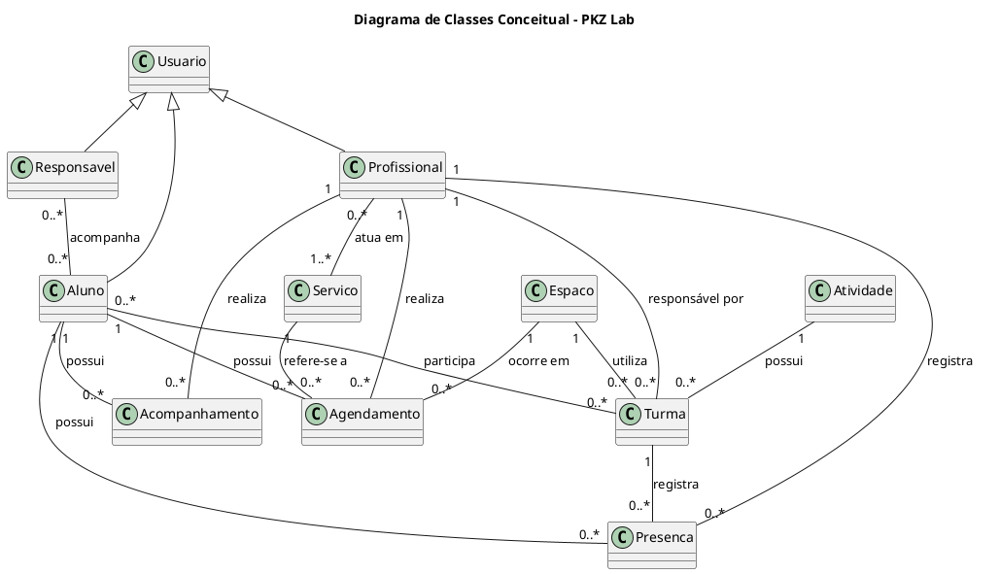

---

id: diagrama_de_classes
title: Diagrama de Classes
--------------------------

# Diagrama de Classes

## Objetivo

Representar os principais conceitos do domínio da PKZ Lab e os relacionamentos necessários para organizar usuários, alunos, responsáveis, profissionais, serviços, turmas, atividades, agendamentos, presença, acompanhamento e espaços.

Este documento apresenta uma visão **conceitual** do domínio. O diagrama utiliza somente nomes de classes, relacionamentos e multiplicidades, sem atributos, métodos ou detalhes de implementação.

## Diagrama

## Classes Representadas

* **Usuario**
* **Aluno**
* **Responsavel**
* **Profissional**
* **Servico**
* **Turma**
* **Atividade**
* **Agendamento**
* **Presenca**
* **Acompanhamento**
* **Espaco**

## Relacionamentos Principais

* Usuário possui especializações em **Aluno**, **Responsável** e **Profissional**.
* **Responsável** acompanha alunos.
* **Profissional** atua em serviços.
* **Atividade** possui turmas.
* **Profissional** é responsável por turmas.
* **Aluno** participa de turmas.
* **Turma** utiliza espaços.
* **Aluno**, **Profissional**, **Serviço** e **Espaço** relacionam-se aos **Agendamentos**.
* **Presença** relaciona aluno, turma e profissional.
* **Acompanhamento** relaciona aluno e profissional.

## Observação

Este diagrama corresponde à visão conceitual do domínio. Conforme o projeto evoluir, poderá ser criado o **Diagrama de Classes de Especificação**, acrescentando atributos, tipos, métodos, visibilidade e outros detalhes necessários à implementação.

O modelo conceitual deve permanecer alinhado aos requisitos e casos de uso do sistema.

| Data | Versão | Descrição | Autor(es) |
| -- | -- | -- | -- |
| 23/09/2026 | 1.0 | Criação da versão inicial | Brenno Marques Silva |