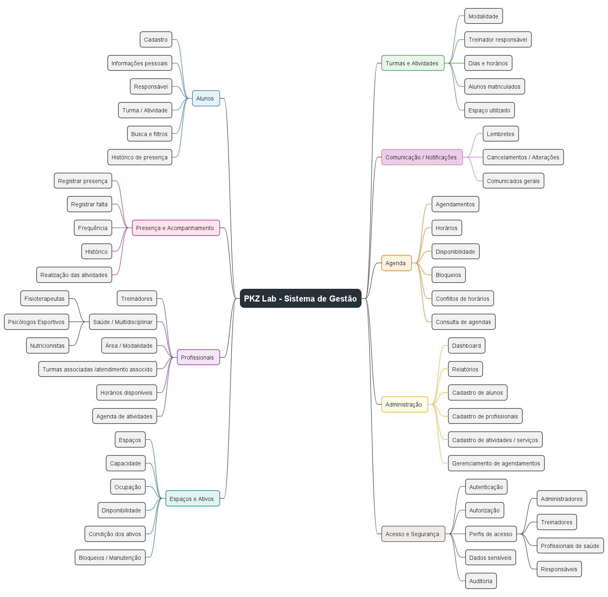

 
# Mapas Mentais

## Introdução

O mapa mental é uma ferramenta utilizada para organizar e representar visualmente informações relacionadas a um determinado tema. Por meio de uma estrutura hierárquica, cores e ramificações, é possível destacar os principais conceitos e facilitar a compreensão das relações entre eles.

Neste projeto, o mapa mental foi utilizado para organizar as principais funcionalidades e componentes identificados para o sistema de gestão do PKZ Lab, proporcionando uma visão geral da solução proposta.

## Metodologia

Para a elaboração do mapa mental, foram analisadas as informações levantadas durante as etapas de iniciação do projeto, incluindo o brainstorming, as funcionalidades previstas e as pesquisas realizadas pela equipe.

A partir dessas informações, os principais elementos do sistema foram agrupados em categorias relacionadas às suas responsabilidades e funcionalidades, como alunos, profissionais, turmas e atividades, agenda, presença, espaços e ativos, administração, comunicação e segurança.

O mapa foi desenvolvido utilizando o PlantUML, permitindo sua representação de forma estruturada e facilitando sua manutenção e atualização ao longo do desenvolvimento do projeto.

## Mapa Mental - Geral

O mapa mental apresenta uma visão geral do sistema de gestão do PKZ Lab, organizando suas principais áreas funcionais e suas respectivas características.

## Versão 1.0

### Mapa Mental 1

A primeira versão do mapa mental apresenta a estrutura geral do sistema, destacando os principais grupos de funcionalidades identificados durante o levantamento inicial dos requisitos.

Entre os principais grupos representados estão:

* Alunos;
* Presença e Acompanhamento;
* Profissionais;
* Espaços e Ativos;
* Turmas e Atividades;
* Comunicação e Notificações;
* Agenda;
* Administração;
* Acesso e Segurança.

A organização desses grupos permite visualizar de forma rápida os principais elementos que compõem o sistema e suas respectivas responsabilidades.

## Conclusão

O mapa mental possibilitou organizar visualmente as principais funcionalidades e áreas do sistema de gestão do PKZ Lab. A representação facilita a compreensão do escopo inicial do projeto e permite identificar a relação entre diferentes componentes do sistema.

Além disso, o mapa poderá ser atualizado conforme novos requisitos forem identificados ou funcionalidades forem definidas durante as próximas etapas do desenvolvimento.

## Referências

* [Documentação de Brainstorm do projeto PKZ Lab.](./Brainstorm.md).
* [Documentação de funcionalidades previstas do projeto PKZ Lab.](./Pesquisa/funcionalidades_previstas.md)
* [Documentação de descrição do projeto.](./Pesquisa/descricao_projeto.md).
* [Documentação de Gestão de Ativos e Espaços.](./Pesquisa/gestao_ativos_e_espacos.md)
* [Documentação de 5W2H do projeto.](./5w2h.md)

## Versionamento

| Data       | Versão | Descrição                                                       | Autor(es)         |
| ---------- | ------ | --------------------------------------------------------------- | ----------------- |
| 23/09/2026 | 1.0    | Criação e documentação do mapa mental geral do sistema PKZ Lab. | Juan Lucas Pereira |
