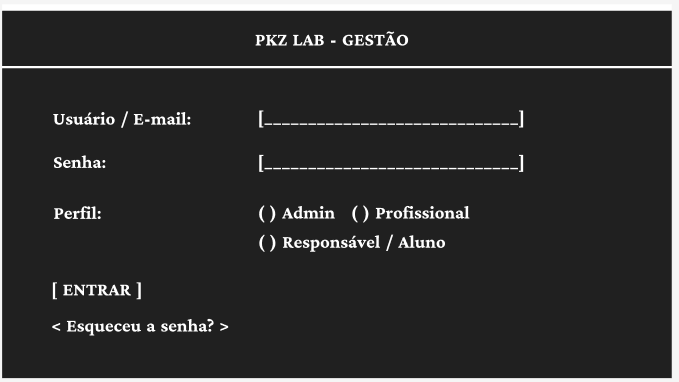
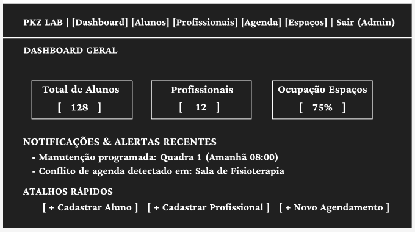
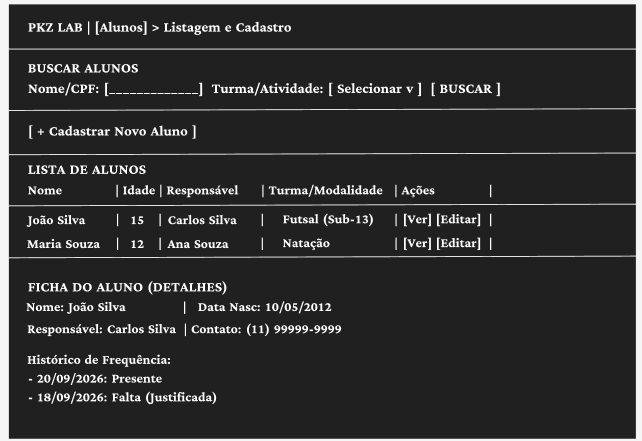
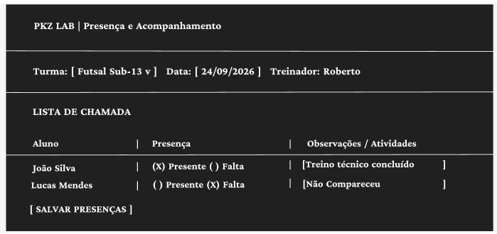
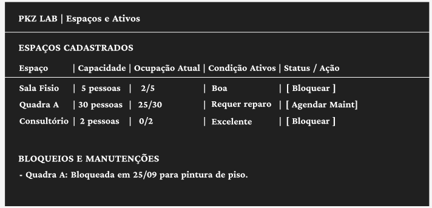
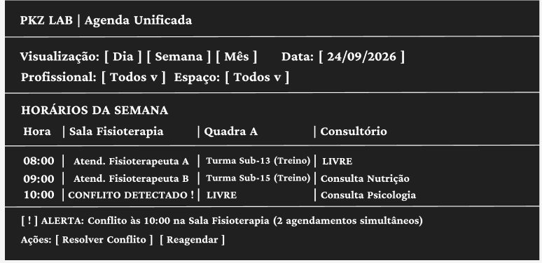
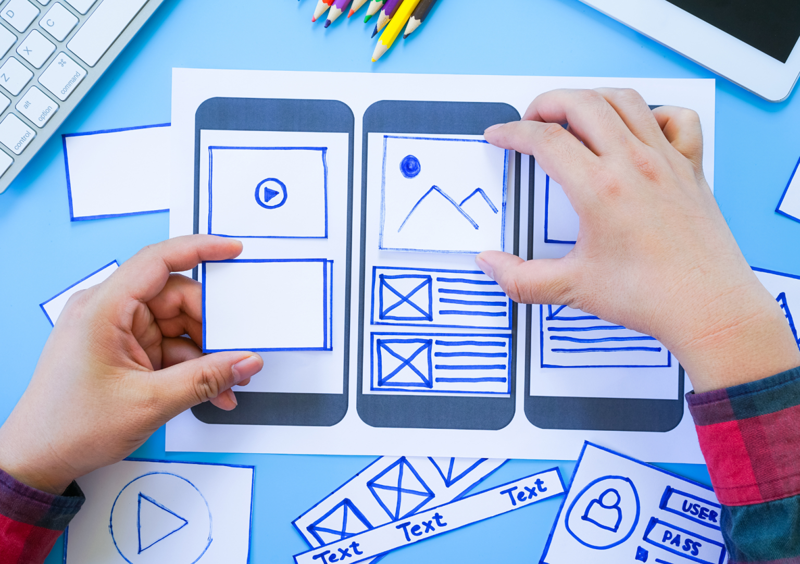

## Introdução

O protótipo de baixa fidelidade é uma etapa essencial no desenvolvimento do projeto, agindo como a ponte entre a ideia abstrata e a implementação real.

Aqui estão os principais motivos que justificam a sua importância:

Validação Rápida da Arquitetura de Informação: Permite testar a disposição dos elementos, o fluxo de telas e a hierarquia dos dados com a equipe ou clientes antes de escrever qualquer linha de código.

Economia de Tempo e Recurso (Baixo Custo de Mudança): Alterar uma tela em formato de desenho/texto leva segundos. Descobrir que uma regra de negócio ou campo está faltando depois que o banco de dados e a API já foram codificados custa dezenas de horas de retrabalho.

Clareza para o Back-End: Ajuda os desenvolvedores a visualizarem exatamente quais endpoints (GET, POST, PUT, DELETE), parâmetros de busca, regras de acesso (perfis) e relacionamentos no banco de dados serão necessários para sustentar a interface.

Foco na Funcionalidade (Sem Distrações Estéticas): Por não ter cores, logotipos ou tipografia refinada, as discussões se concentram 100% nas regras de negócio, na usabilidade e na lógica do sistema, sem perder tempo com "deveria ser azul ou verde".

Facilidade na Identificação de Falhas de Escopo: Facilita notar lacunas no fluxo — como telas esquecidas (ex: onde tratar conflito de horários ou onde cadastrar os responsáveis) — antes de avançar para etapas mais complexas.

Em resumo, ele funciona como a planta baixa de uma casa: ninguém constrói as paredes ou escolhe a pintura sem antes validar o desenho das salas e onde passam os canos.

## Metodologia

Iniciamos o projeto através dos levantamentos iniciais da equipe, após discussões a ferramenta Figma foi selecionada para produzir o protótipo de baixa fidelidade com base em Wireframes de Baixa Fidelidade (Textual).

## Protótipo de alta fidelidade

### Versão 1.0

### Tela 1: Login e Autenticação

### Tela 2: Dashboard Administrativo

### Tela 3: Gestão de Alunos

### Tela 4: Registro de Presença e Acompanhamento

### Tela 5: Gestão de Espaços e Ativos

### Tela 6: Agenda e Conflitos

### Tela Perfil

### Tela Cadastrar torneio 1

### Tela Cadastrar torneio 2

### Tela Cadastrar torneio 3

### Tela Cadastrar torneio 4

### Tela com meus torneios

### Tela de inscrição em torneio

Na primeira versão do protótipo utilizamos a ferramenta <a href="https://material.io/resources/color/#!/?view.left=0&view.right=0">Material Design Color Tool</a>  para auxiliar na criação da paleta de cores do aplicativo, definimos as cores base do aplicativo mas as cores definidas para as telas 12 e 13 ainda não foram decididas.

### Versão 2.0

### Versão 1.0

### Tela Login

### Tela Cadastro 1

### Tela Cadastro 2

### Tela Esqueceu Senha

### Tela do Feed

### Tela Feed com configurações

### Tela Perfil

### Tela Cadastrar torneio 1

### Tela Cadastrar torneio 2

### Tela Cadastrar torneio 3

### Tela Cadastrar torneio 4

### Tela com meus torneios

### Tela de inscrição em torneio

link para o `<a href="https://www.figma.com/">`Protótipo`</a>`

## Conclusão

A partir da elaboração do protótipo foi possível ter uma noção inicial da interface do usuário, definindo fluxo, paleta de cores, botões, app bars e diversas outras funcionalidades

## Referências

> Material Design Color Tool. Disponível em:  https://material.io/resources/color/#!/?view.left=0&view.right=0

> PMI. Um guia do conhecimento em gerenciamento de projetos. Guia PMBOK® 5a. ed. EUA: Project Management Institute, 2013.

> Ferramenta Figma. Disponível em https://www.figma.com

## Autor(es)

| Data     | Versão | Descrição                            | Autor(es)                                                                            |
| -------- | ------- | -------------------------------------- | ------------------------------------------------------------------------------------ |
| 07/09/20 | 1.0     | Criação do documento                 | Lucas Alexandre e Matheus Estanislau                                                 |
| 07/09/20 | 1.1     | Adicionado as imagens do protótipo    | Lucas Alexandre e Matheus Estanislau                                                 |
| 07/09/20 | 1.2     | Adicionado conclusão e referências   | Lucas Alexandre e Matheus Estanislau                                                 |
| 26/10/20 | 2.0     | Adicionada a versão 2.0 do protótipo | João Pedro, Lucas Alexandre, Matheus Estanislau, Moacir Mascarenha e Renan Cristyan |
